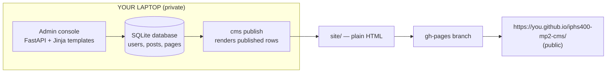
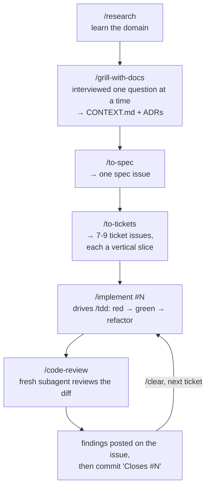

# Mini-Project #2 — Build a Web CMS with Claude Code

**Course:** IPHS 400 — Frontiers in AI, Kenyon College
**Instructor:** Jon A. Chun · **Date:** 2026-09-22 · **Weeks 5–6**
**Format:** Self-guided lab manual. Work at your own pace between class meetings.

---

## Front matter

### What you are building

A content management system: the kind of software WordPress and Drupal are. An **admin console** where you log in, write posts and pages, manage users, and publish; and a **public website** generated from what you published.

The admin console runs on **your laptop only**. The public site is exported as plain HTML and published to **GitHub Pages**. You will not write the CMS by hand. You will drive Claude Code through a professional workflow — interview, spec, tickets, test-first implementation, code review — and the code will come out of that pipeline.

### Time and deadlines

| Stage | What is due | When (Eastern, EDT) |
|---|---|---|
| **Stage 1 — MVP** | Planning artifacts + first 3 tickets, deployed, tagged `mp2-mvp` | Soft target **Tue Sep 29, 2:40 pm** |
| **Stage 2 — Full CMS** | All 7 capabilities, tagged `mp2-final`, report emailed | **Tue Oct 6, 2:40 pm**, no-penalty grace to **Wed Oct 7, 2:40 pm** |

Stage 1 is a *soft* target: its 15 points count as long as the tag exists before the Stage 2 deadline. But you only get feedback in time to use it if you submit on time.

| Part | Topic | Time |
|---|---|---|
| 0 | Overview | 20 min |
| 1 | Setup: template, skills, first green test | 45 min |
| 2 | See a real CMS (WordPress Playground) | 30 min |
| 3 | Your client brief | 20 min |
| 4 | Exercise A — context-threshold hook | 30 min |
| 5 | Exercise B — token budget | 45 min |
| 6 | The loop: grill → spec → tickets → implement → review | 6–9 hrs |
| 7 | Publish to GitHub Pages | 30 min |
| 8 | Submit Stage 1 / Stage 2 | 45 min |
| 9 | Plan B (only if you run out of usage) | 20 min |
| | **Total** | **11–14 hours over two weeks** |

### Prerequisites

- The setup from `manual_ai-swe-setup-macos-win11`: Ghostty (or Windows Terminal + WSL2), `git`, `gh`, `uv`, VS Code, Chrome, Claude Code.
- A Claude Pro subscription ($20/month).
- MP1 finished: you have forked, cloned, committed, and pushed before.

### Learning objectives

By the end you will be able to:

1. Explain how a CMS separates content, roles, and publishing, using the vocabulary of your own project.
2. Run the mattpocock AI-SWE pipeline end to end and say what each stage is for.
3. Write tickets as **tracer bullets**: thin vertical slices through data, route, UI, and tests.
4. Keep an agent honest across many sessions with `CONTEXT.md`, a spec, `/clear`, `/compact`, and `/handoff`.
5. Budget a fixed-price plan by measuring your own usage instead of guessing.
6. Ship a working, secure-by-baseline web application and publish its output.

### Deliverables checklist

Tick every line before you submit Stage 2. `scripts/check_submission.py` checks all of them for you.

- [ ] `notes/cms-field-notes.md` — what you noticed inside a real CMS
- [ ] `CONTEXT.md` — your project's glossary · `docs/adr/` — decisions you cannot easily undo
- [ ] One GitHub issue labeled `spec`; 7–9 issues labeled `ticket`
- [ ] A `/code-review` findings comment on every ticket before it closes
- [ ] `docs/transcripts/` — one file per Claude session · `docs/handoff/` — at least one
- [ ] `docs/process/compaction-log.md` — written by your hook
- [ ] `notes/token-budget-plan.md` and `notes/usage-ledger.csv`
- [ ] `docs/screenshots/` — 6 admin screens × 2 widths
- [ ] `docs/iphs400_mp2-web-cms_report_{first}-{last}_{YYYYMMDD}.md`
- [ ] README with *Live URL*, *Run locally*, *Generative AI Use Statement*
- [ ] Live site at `https://{username}.github.io/iphs400-mp2-cms/`
- [ ] Tags `mp2-mvp` and `mp2-final` pushed

Grading: the rubric is `docs/mp2-grading-rubric_20260922.md` in the starter repo you copy. Read it **before** you start, not after. Pass/No-Pass, ≥70 passes, 5% of the course grade.

---

## Part 0 — Overview

### 0.1 Why a CMS

Every newspaper site, club page, and university department runs on one. A CMS is where three ideas meet that you have not built before:

- **Identity and permission.** Who are you, and what are you allowed to do? An editor writes; only an admin creates users. That difference is enforced in code, or it is not real.
- **Content as data.** A post is not a file of HTML. It is a row with a title, a slug, a body, a status, an author, and dates. Everything else — the admin list, the public page, the navigation — is generated from those rows.
- **Draft versus published.** The thing you are editing and the thing the world sees are deliberately not the same.

This is also the first project in this course where a mistake has consequences beyond ugliness: an access-control bug means a user can do something they should not.

### 0.2 The shape of what you build



The admin console never goes on the internet. Nobody can attack a server that is not running, and your database and passwords stay on your machine. Publishing is a one-way door: rows in, static HTML out.

### 0.3 The workflow you are learning



Four rules make this work, and all four are graded:

1. **The spec is the single source of truth.** When code and spec disagree, one of them is wrong, and you decide which — you do not let it slide.
2. **`CONTEXT.md` is the shared vocabulary.** If you call it a "bulletin" and the model calls it a "post", you will get two designs.
3. **One ticket per fresh context.** `/clear` between tickets. Long tickets get `/compact` at a green test.
4. **The reviewer must not be the author.** `/code-review` runs in a fresh subagent because an agent that just wrote code approves its own work.

### 0.4 What is given, what you build

| The template gives you | You build |
|---|---|
| Stack and dependencies: FastAPI, Jinja2, SQLite, argon2 hashing, Markdown sanitizer | All 7 capabilities |
| **T00, already done:** a "hello admin" page, one passing test, `cms publish` shipping a placeholder to Pages | Your data model, login, roles |
| Folder layout and test helpers such as `client_as("editor")` | Every route, form, and screen |
| Two example ADRs, a security checklist, `CLAUDE.md`, hooks, pinned skills, `check_submission.py`, README skeleton | Your own ADRs, spec, tickets, tests |

The template contains **no CMS features**. That is deliberate: features are what you are being taught to produce.

---

## Part 1 — Setup

**Time: 45 min. Usage cost: under 5% of a window — mostly shell commands.**

### 1.1 Make your repo from the template

1. Open `https://github.com/jon-chun/iphs400-mp2-cms-starter`.
2. Click the green **Use this template** button → **Create a new repository**.
3. Owner: your account. Name: **`iphs400-mp2-cms`** exactly. Visibility: **Public**. Click **Create repository**.

> **Why not Fork?** In MP1, forks got re-parented to a classmate's repo, and "Sync fork" pulled *their* commits into people's work. A template copy has no fork network, so this cannot happen. It also arrives with Issues switched on, which forks do not.

### 1.2 Clone and install

```bash
cd ~/code            # or wherever you keep projects
gh repo clone <your-username>/iphs400-mp2-cms
cd iphs400-mp2-cms
uv sync
```

**Expected:** `uv` prints a list of installed packages ending with a `Resolved … Installed …` summary.
**If `gh` says you are not logged in:** run `gh auth login` → GitHub.com → HTTPS → authenticate in the browser.

### 1.3 Run T00, the walking skeleton

```bash
cp .env.example .env
uv run cms serve
```

Open `http://localhost:8000/admin` in Chrome. **Expected:** a plain page reading *T00: hello admin*. Stop the server with `Ctrl+C`.

This proves the whole chain works — Python, the app, the templates — before you add anything. If it fails now, fix it now; do not start the grill on a broken setup.

### 1.4 Configure the skills

```bash
claude
```

Then, inside Claude Code:

```text
/setup-matt-pocock-skills
```

Answer its questions:

- **Issue tracker:** GitHub (it will use `gh`; confirm your repo).
- **Triage labels:** accept the defaults.
- **Domain documentation:** single context.

**Expected:** it writes a few lines into `CLAUDE.md` and confirms the tracker. Check with:

```text
/ask-matt what is the flow for building a feature from scratch?
```

**Expected:** it names `/grill-with-docs → /to-spec → /to-tickets → /implement → /code-review`.

> **Name clash.** This skill set ships its own `/teach`, which is different from the `/teach` you wrote in Week 4. In this repo, `/teach` means the mattpocock one. If you want yours here, copy it to `.claude/skills/teach-log/SKILL.md` and rename it inside the file. Vetting names before installing is a real skill; this is your first collision.

### 1.5 Learn the three help commands

| Command | When to use it |
|---|---|
| `/ask-matt <question>` | You do not know which skill or command fits. It routes you. |
| `/wait-what` | A reply did not land. It re-pitches the last message in plain English using your own vocabulary. |
| `/teach <topic>` | You want to be taught something over several sessions, with the repo as the workspace. |

Try `/wait-what` once now, right after any answer you fully understood, so you know what it looks like before you need it at midnight.

### 1.6 Record your setup

```bash
claude --version >> notes/setup_check.md
```

Commit what you have:

```text
Commit and push everything with the message "setup: template configured, T00 green".
```

---

## Part 2 — See a real CMS before you design one

**Time: 30 min. Usage cost: ~5%.**

You cannot be interviewed about something you have never used. Fix that first.

### 2.1 Field trip: WordPress Playground

Open **`https://playground.wordpress.net`**. It runs a complete WordPress in your browser tab. Nothing installs; closing the tab wipes it. Break whatever you like.

Do all six, in order:

1. Write a **post**: title, a paragraph, **Save draft**. Visit the public site in another tab — it is not there.
2. **Publish** it. Reload the public site — now it is.
3. Write a **page** ("About"). Notice where pages show up that posts do not: the navigation menu.
4. Open **Settings → Permalinks**. Look at how the URL is built from the title. That string is the *slug*.
5. **Users → Add New**: create a user with the **Editor** role. Log out, log in as them. Try to reach **Users**. Write down exactly what happens.
6. Find where **Posts → All Posts** lets you filter by status. That screen is the content list you will build.

### 2.2 Write your field notes

Create `notes/cms-field-notes.md` with **at least five** observations *in your own words*. Useful things to notice: what surprised you, what was hidden, what took more clicks than you expected, what you could not find, what an editor could not do.

These notes are graded (S1.1) and they are the raw material for your grill answers. Write like you are telling a friend, not like you are writing a lab report.

### 2.3 Get the vocabulary

```text
/clear
/research how content management systems model content, users and roles, and publishing — compare WordPress, Drupal, and static-site generators
```

Skim the output for terms: *content type, slug, draft/published, role, capability, permalink, taxonomy, theme, headless*. You do not need all of them. You need the handful you will actually use.

---

## Part 3 — Your client

**Time: 20 min.**

You are not building "a CMS". You are building one for someone, because specific people make specific demands, and those demands are what make your project yours.

### 3.1 Pick a client

Choose a real or plausible one you know something about: a club you belong to, a lab, a band, a campus office, a family business, a team. You will not contact them; you just need their reality.

**If nothing comes to mind**, use the default:

> **Knox County Historical Society.** Three volunteers run the site. Karen, the secretary, posts meeting announcements and event notices weekly; she is comfortable with email and nothing more. Tom, the president, writes longer research pieces every month or two and wants them to look permanent. Nobody should be able to edit the membership page except Tom. Their current site is a Facebook page they cannot search, and members ask them the same three questions every month: when is the next meeting, where is it, and what is on the agenda.

If you take the default, add **at least three details of your own** — a person, a constraint, a recurring frustration. Generic input produces a generic project, and that costs points under factor A.

### 3.2 Write the brief

Create `notes/client-brief.md`. Half a page, in your words:

- Who runs the site, and how comfortable are they with computers?
- Who reads it, and what are they usually trying to find?
- What is broken about how they do it now?
- What would make them say "this is better"?
- What must **not** happen? (e.g. "a volunteer must never be able to delete the members page")

### 3.3 The required capabilities

Your CMS can name things however your client would. Underneath, all seven of these must work. This list is fixed; how you get there is yours.

1. **Login** — admins and editors sign in and out; passwords are stored hashed, never as text.
2. **Two roles** — *admin* and *editor*, with genuinely different permissions.
3. **Posts** — create, read, update, delete; title, slug, Markdown body, draft/published, author, timestamps.
4. **Pages** — same, and published pages appear in the public navigation.
5. **Admin console** — dashboard with counts, a content list you can filter, an editor with a preview.
6. **User management** — admin only: create users, change roles, deactivate; a deactivated user cannot log in.
7. **Public site and publish** — only published content, Markdown sanitized, nav built from pages, `cms publish` writes `site/` with relative paths.

**Deliberately excluded** (do not build these): multi-site, drag-and-drop page builders, rich-text WYSIWYG editors. They cost far more than they teach.

---

## Part 4 — Exercise A: the context-threshold hook

**Time: 30 min.** Full instructions: `docs/mp2-setup_context-threshold-hook_20260922.md` in your repo. Summary:

You will finish a `Stop` hook that warns you when your context window crosses 50%, 60%, and 80%, and a `PreCompact` hook that logs every compaction. The status line shows a live meter.

The rule the meter serves: **`/clear` between short tickets; `/compact` at a green test for long ones**, always with a focus note like

```text
/compact keep: ticket #5 acceptance criteria, what is left, files touched
```

Your job is `decide()` in `.claude/hooks/ctx_guard.py`; seven tests fail until it works:

```text
/clear
/tdd Implement decide() in .claude/hooks/ctx_guard.py so the failing tests in tests/test_ctx_guard.py pass. Do not change the tests.
```

Graded as B6.

---

## Part 5 — Exercise B: the token budget

**Time: 45 min.** Graded as B7 (3 pts) and discussed in your report.

### 5.1 Why you cannot budget in tokens

Anthropic does not publish a token count for Pro. Usage is metered as a **rolling 5-hour session** plus a **weekly cap across all models**, and what you spend depends on message length, conversation length, attachments, tool use, model, and effort level. So you cannot plan in tokens. You can plan in **percent of your own meters**, and that is what this exercise builds.

### 5.2 The meter

Part 4's status line already reports rate limits when your plan provides them:

```text
[Sonnet·medium] ctx 52% ▓▓▓▓▓░░░░░ │ 5h 31% │ wk 18%
```

- **ctx** — how full this conversation is. Fix with `/compact` or `/clear`.
- **5h** — your rolling session window. When it hits 100%, you wait.
- **wk** — your weekly cap. This is the one that can end your project week on a Thursday.

### 5.3 The ledger, which writes itself

The same `Stop` hook appends one row per turn to `notes/usage-ledger.csv`:

```text
ts,session,phase,provider,model,effort,ctx_pct,five_h_pct,weekly_pct
2026-09-30T14:03:11Z,7c1a9b02,T03,anthropic,Sonnet,medium,52.0,31,18
```

The `phase` column comes from `.claude/state/phase`. `CLAUDE.md` tells Claude to write the phase there when a stage starts, so labeling is automatic. Check it yourself at any time:

```bash
cat .claude/state/phase        # expect: grill, spec, tickets, or T03
```

### 5.4 Write your budget plan (before your first ticket)

Create `notes/token-budget-plan.md`. Start from this default mapping, which follows Anthropic's own guidance — Sonnet for most coding, Opus for architecture and hard debugging, Haiku for quick mechanical work — and then **edit it to match what `/model` actually offers your account**:

| Stage | Model | Effort | Your estimate (% of a 5-hour window) |
|---|---|---|---|
| `/research`, quick lookups | Haiku | low | |
| `/grill-with-docs`, `/to-spec`, `/to-tickets` | `opusplan` or Opus | high | |
| `/implement` + `/tdd` (per ticket) | Sonnet | medium | |
| `/code-review` (per ticket) | Sonnet | high | |

Then answer, in writing: how many 5-hour windows will the 9 tickets take? How much of one week is that? Which stage will you cut first if you are wrong?

Your first estimates will be bad. That is fine — 5.6 corrects them with data.

### 5.5 Switch models deliberately

```text
/model              # see what your account has, and switch
/model opusplan     # Opus while planning, Sonnet for execution
```

`/model opusplan` is built for exactly the split this workflow uses. Switching does not clear the conversation, so Sonnet still sees everything Opus decided.

Four habits that stretch a window furthest, from Anthropic's own guidance: `/clear` between tasks; match the model to the job; reference files by path instead of pasting them; keep `CLAUDE.md` short, since it is prepended to every turn.

### 5.6 Measure, then re-forecast

The template ships `scripts/usage_report.py` with one function left blank: `spend()`, which sums a meter's *increases* and ignores its resets. Four tests fail until you write it.

```text
/clear
/tdd Implement spend() in scripts/usage_report.py so tests/test_usage_report.py passes. Do not change the tests.
```

After T01, and again after T03:

```bash
uv run python scripts/usage_report.py --remaining 6
```

**Expected:**

```text
phase          turns  5h spent   weekly  models / provider
T01               14     22.0%     4.0%  Sonnet
grill             22     31.0%     6.0%  Opus

Tickets done: 1 · average weekly cost per ticket: 4.0%
Forecast: 6 tickets need ~24% of the weekly cap; 71% remains → FITS
```

If the forecast says TIGHT or OVER BUDGET, apply the fixes in order: **lower effort → switch to Sonnet or Haiku → `/clear` more often → split fat tickets → Plan B (Part 9)**. Re-run after each change.

Your report must compare plan against actual with real numbers from this ledger.

---

## Part 6 — The loop

**Time: 6–9 hours across several sittings. This is the project.**

### 6.1 Grill (one session, fresh window)

```text
/clear
/grill-with-docs I am building a small CMS for <your client, in one sentence>. Here are my field notes: notes/cms-field-notes.md and my brief: notes/client-brief.md. The 7 required capabilities are in the manual; help me decide what they mean for this client.
```

It asks **one question at a time**, with a recommended answer attached. How to be good at this:

- **Answer with your client's reality**, not with generalities. "Karen posts weekly and will never remember a slug" is worth more than "yes, sounds good."
- **Override the recommendation when you disagree**, and say why. That sentence is the single strongest evidence of your own judgment, and factor A samples exactly these answers.
- **Watch `CONTEXT.md` fill up** as terms resolve. Open it in VS Code beside the terminal.
- **Expect few or no ADRs.** They are reserved for decisions that are hard to reverse. Two are already written for you as examples.

Stop when you can answer, without hedging: what is a post here, what is a page, who may do what, what does publishing mean, and what is explicitly out of scope.

### 6.2 Spec, then tickets (same unbroken window)

```text
/to-spec
```

It turns the conversation into a spec and posts it as an issue labeled `spec`. Read the issue on GitHub. If it says something you did not decide, fix it now — everything downstream inherits it.

```text
/to-tickets
```

**Expected:** 7–9 issues labeled `ticket`, each with acceptance criteria and its blocking edges. Aim for tickets that look like this:

- ✅ **T03 — Editors can create and edit posts** (touches the model, a route, a template, and tests; demoable alone)
- ❌ **T03 — Add all database models** (one layer only; nothing works until everything lands)

This is the **tracer bullet** idea: each ticket is a narrow but complete path through every layer, verifiable the moment it lands. If a ticket cannot be demoed by itself, split or merge it now — `/to-tickets` again with what you want changed.

Check your set on GitHub:

```bash
gh issue list --label ticket
```

### 6.3 The per-ticket runbook

Repeat for each ticket, in blocking order. One ticket per fresh session.

```text
/clear
/implement #3
```

Claude reads the ticket, the spec, and `CONTEXT.md`, then drives `/tdd`: a failing test first, then code, then a green test. **You never run pytest yourself.**

When it is green:

```text
/code-review
```

It reviews the change in a fresh subagent against the repo's standards and the spec. Fix what it finds, or push back with a reason if you disagree — your reason is worth points under A5.

Then, in one instruction:

```text
Post the code-review findings and how each was resolved as a comment on issue #3, then commit and push with a message that starts "T03:" and ends "Closes #3".
```

Finally, confirm on GitHub (10 seconds, do not skip):

```bash
gh issue view 3
```

**Expected:** state CLOSED, with your review comment above the closing commit.

> **Why this order matters for your grade.** The judge checks that the ticket existed before the commit that closed it, and that a review comment arrived before the close. Those timestamps are GitHub's, not yours, which is exactly why they are trusted.

### 6.4 When a ticket runs long

- At **50%**, finish the current red-green cycle.
- At **60%**, at the *next green test*: `/compact keep: ticket #N acceptance criteria, what is left, files touched`.
- At **80%**, compact immediately, or `/handoff` and start fresh. Then ask whether the ticket should have been two tickets.

If you leave a session for a different tool, directory, or task, use `/handoff`, and copy the file it writes into `docs/handoff/{NN}_{purpose}_{YYYYMMDD}.md`. At least one handoff is required.

### 6.5 Drift: catching the model inventing things

Drift is when the code and your spec quietly stop agreeing: a field renamed, a rule dropped, a "helpful" feature nobody asked for. It is normal, and catching it is half of what this workflow is for.

Three catches, in order of how cheap they are:

1. **`CONTEXT.md` mismatch.** The model says "article" where your glossary says "post". Correct the vocabulary immediately; it is never only vocabulary.
2. **A test that asserts the wrong thing.** Read the test `/tdd` writes *before* you let it pass. A test written against a misunderstanding will happily go green.
3. **`/code-review` against the spec.** It compares the diff with the spec issue, which is why the spec must stay true.

Your report has to describe **one real instance of this**: what drifted, and which of these caught it. Keep a note when it happens — you will not remember in a week.

### 6.6 GitHub, for people who just started

| You want to… | Command | Expected |
|---|---|---|
| See what changed | `git status` | a list of modified files |
| See your history | `git log --oneline -10` | one line per commit |
| Confirm a push landed | `gh repo view --web` | the browser shows your latest commit |
| See your tickets | `gh issue list --label ticket` | your open tickets |
| Read one ticket | `gh issue view 3` | title, body, comments, state |
| Tag a stage | `git tag mp2-mvp && git push --tags` | `* [new tag] mp2-mvp` |

**When GitHub confuses you, in this order:**

1. **Read the error.** Git errors usually say the fix.
2. **Ask the tool:** `gh issue --help`, `git status`.
3. **Ask Claude to explain before changing anything:** *"I ran X and got this error: <paste>. Explain what it means and what my options are. Do not change any files yet."*
4. **Check the docs** linked in the troubleshooting table below.
5. **Run `/teach-log`** to record what happened and how you fixed it.
6. **Email the instructor** with the command and the full error pasted in.

| Symptom | Cause | Fix |
|---|---|---|
| `! [rejected] … fetch first` | GitHub has commits you do not | `git pull --rebase` then push again |
| `gh: not logged in` | token expired | `gh auth login` |
| Issue did not close | commit message lacked `Closes #N` | `gh issue close 3 --comment "closed by <sha>"`, and use the exact phrase next time |
| `detached HEAD` | you checked out a commit or tag | `git checkout main` |
| Committed `cms.db` or `.env` | gitignore bypassed | tell Claude: *"remove cms.db from git tracking and history, keep the local file"* — then check `git log --all -p` |
| Push rejected: secret detected | a key reached a commit | rotate the key first, then ask Claude to rewrite history |

---

## Part 7 — Publish to GitHub Pages

**Time: 30 min. Do this in Stage 1, not at the end.**

```bash
uv run cms publish          # renders site/ from published rows
uv run cms deploy           # pushes site/ to the gh-pages branch
```

Then, once, on GitHub: **Settings → Pages → Build and deployment → Deploy from a branch → `gh-pages` / root → Save**. Wait up to 10 minutes, then open `https://<username>.github.io/iphs400-mp2-cms/`.

**Relative paths matter.** Your site lives in a subfolder, so `/style.css` (leading slash) breaks while `style.css` and `../style.css` work. In MP1 seven sites would have broken on deploy for exactly this reason. Check before you submit:

```bash
git grep -n 'href="/\|src="/' gh-pages -- '*.html' | head
```

**Expected:** no output.

| Symptom | Fix |
|---|---|
| 404 after 10 minutes | Pages not enabled, or wrong branch selected |
| Page loads, no CSS | root-absolute paths; see above |
| Old content | you edited rows but did not re-run `cms publish` |
| Draft content is public | your publish step is not filtering on status — that is a bug, and a security-ish one |

---

## Part 8 — Submitting

### 8.1 Stage 1 (Tue Sep 29)

```bash
uv run python scripts/check_submission.py --stage 1
git tag mp2-mvp && git push --tags
```

Fix every failure the checker reports, then email:

- **Subject:** `IPHS400 MP2 Stage 1 — First Last`
- **Body:** repo URL, Pages URL, tag name.

You get a short report back within 48 hours: the checker results, whether your ticket set is sound, and the one fix to make before Stage 2.

### 8.2 Stage 2 (Tue Oct 6, grace to Oct 7)

**Screenshots** (6 screens × 1280 px and 390 px) into `docs/screenshots/`: login, dashboard, content list, editor, users, and the page an editor sees when refused an admin screen.

**README** must have: *Live URL*, *Run locally* (steps that actually work on a clean clone), and a *Generative AI Use Statement* containing your models and skills, **two prompts you really used, quoted**, **one real model failure**, and a *Backends used* table (see Part 9).

**Report** — `docs/iphs400_mp2-web-cms_report_{first}-{last}_{YYYYMMDD}.md`, 1–2 pages, answering four questions:

1. What did you build, and which decisions in the grill were **yours**?
2. Where did the AI drift or invent something, and what caught it?
3. Which skills, prompts, and resources did you use, and why those?
4. What would you add next, and what did the budget data tell you?

Write it yourself. Edited AI drafting is fine; unedited AI output is the single biggest cost in the rubric. Include the specific: a bug you hit, a decision you regret, a number from your ledger.

```bash
uv run python scripts/check_submission.py --stage 2
git tag mp2-final && git push --tags
```

Email with subject `IPHS400 MP2 Stage 2 — First Last`, the three links, and the report attached.

---

## Part 9 — Plan B: swapping the backend (emergencies only)

Use this **only** if your forecast in 5.6 says you will run out of Pro usage before Stage 2. Anthropic stays required for the grill, spec, tickets, and `/code-review`, so everyone's process evidence stays comparable.

### 9.1 Set it up without breaking your normal setup

Keep the config **outside the repo** and launch it with an alias, so plain `claude` still uses Pro and no key ever reaches a commit.

```bash
mkdir -p ~/.config/iphs400 && chmod 700 ~/.config/iphs400
cat > ~/.config/iphs400/claude-or.json <<'JSON'
{ "env": {
    "ANTHROPIC_BASE_URL": "https://openrouter.ai/api",
    "ANTHROPIC_AUTH_TOKEN": "<your-openrouter-key>",
    "ANTHROPIC_API_KEY": ""
} }
JSON
chmod 600 ~/.config/iphs400/claude-or.json
echo 'alias claude-or="claude --settings ~/.config/iphs400/claude-or.json"' >> ~/.zshrc
```

OpenRouter's docs require exactly this: the full URL including the scheme, the key in `ANTHROPIC_AUTH_TOKEN`, and `ANTHROPIC_API_KEY` explicitly blanked so Claude Code does not fall back to authenticating with Anthropic directly.

For **Z.ai (GLM)** the same file instead holds `"ANTHROPIC_BASE_URL": "https://api.z.ai/api/anthropic"`, your Z.ai key in `ANTHROPIC_AUTH_TOKEN`, `"API_TIMEOUT_MS": "3000000"`, and the model-mapping variables (`ANTHROPIC_DEFAULT_SONNET_MODEL`, and so on) from Z.ai's Claude Code documentation. Z.ai's coding plans are paid; check current prices before buying anything.

**Verify:**

```text
/status
```

**Expected:** `Anthropic base URL: https://openrouter.ai/api`.
**If it still shows Anthropic:** a cached login is overriding your variables. Run `/logout` once, relaunch, and check again.

**Optional 10-minute smoke test (recommended, free):** with OpenRouter, pick one of its free models and ask the session to run one trivial task. Now you know the fallback works before you need it.

### 9.2 Rules

- **Switch only at ticket boundaries**, right after `/clear`. Never mid-ticket.
- **Expect differences.** OpenRouter states Claude Code is only guaranteed with Anthropic's own models; tool calling — which `/tdd` and the skills depend on — can be less reliable elsewhere.
- **Your code goes to a third party.** Read that provider's data policy first.
- **Declare it, three ways:** a row in the README *Backends used* table; a `Backend: <provider> <model>` trailer on every commit made in that session; and the ledger's `provider` column, which records it automatically. The judge checks that all three agree. Using a backup costs you nothing. Hiding it is what costs.

---

## Appendix A — What is in the template

```text
iphs400-mp2-cms/
├── app/                  # T00 skeleton only: you build the rest
├── templates/            # base layout, admin shell
├── scripts/
│   ├── check_submission.py   # run it before every submission
│   ├── seed_demo.py          # your demo data (you extend it)
│   └── usage_report.py       # spend() is your Exercise B stub
├── tests/                # helpers: client_as("editor"), plus exercise tests
├── .claude/
│   ├── hooks/            # ctx_statusline.py, ctx_guard.py (stub), ctx_compact_log.py
│   ├── skills/           # mattpocock skills, pinned
│   └── settings.json     # status line + Stop, PreCompact, SessionEnd hooks
├── docs/adr/             # ADR-001, ADR-002 as format examples
├── notes/                # where your notes and ledger land
├── CLAUDE.md             # standing instructions (keep it short)
├── SECURITY-CHECKLIST.md # what must be true; not how
└── README.md             # skeleton with the three required sections
```

## Appendix B — Glossary

**Slug** — the URL-safe version of a title (`spring-meeting-notes`). **Draft / published** — the status that decides whether the world sees a row. **Role** — a named bundle of permissions (*admin*, *editor*). **Tracer bullet** — a ticket that cuts a thin path through every layer, demoable alone. **ADR** — a short record of a decision that is hard to reverse. **Static export** — rendering database rows into plain HTML files. **CSRF** — an attack where another site submits your form using your logged-in session; the token in each form blocks it. **Sanitizing** — stripping dangerous HTML (like `<script>`) from user-written Markdown before showing it.

## Appendix C — How you are graded (summary)

Stage 1 is 15 points, Stage 2 is 85, and up to 5 extra credit if you are already at 70. Stage 2 factors: authenticity and judgment 17 · workflow fidelity 17 · CMS functionality 15 · security 8 · tests and code 8 · site and admin UX 7 · report and docs 6 · compliance 7. Every point is a checklist item, and every point you lose comes back with a specific fix. The full rubric is `docs/mp2-grading-rubric_20260922.md` in your repo — read it first, and run `check_submission.py` early and often.

## Appendix D — Resources

Claude Code docs: hooks `code.claude.com/docs/en/hooks` · status line `code.claude.com/docs/en/statusline` · usage and models `support.claude.com` · skills `github.com/mattpocock/skills` · GitHub Pages `docs.github.com/en/pages` · FastAPI `fastapi.tiangolo.com` · WordPress Playground `playground.wordpress.net`
