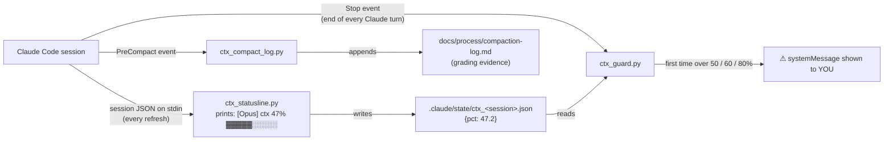

# MP2 Setup Exercise — Context-Threshold Warning Hook

**Course:** IPHS 400 Frontiers of AI, Kenyon College, Fall 2026 (Jon Chun)
**Where this goes:** Student manual, Part 1 (setup), right after the template repo is cloned and `/setup-matt-pocock-skills` has run.
**Time:** 20–30 minutes. **Token cost:** under 3% of a 5-hour window (the scripts cost nothing at runtime; hooks run outside the model).
**Rubric link:** Factor B, item B6 "session hygiene" (3 pts). The judge checks that the hook works and reads `docs/process/compaction-log.md`.
**Verified against:** Claude Code hooks and status-line docs as of 2026-09-22. Record your own version with `claude --version` in `notes/setup_check.md`.

---

## Why you are building this

Pocock's loop runs one ticket per fresh context: `/clear`, then `/implement #N`. Most tickets finish well inside one window. A long ticket does not, and a model working in a very full context forgets the ticket's acceptance criteria and starts to drift from the spec. The course rule is:

- **Short ticket:** `/clear` before it. Nothing else.
- **Long ticket:** once context passes **50–60%**, `/compact` at the next **green test** (the end of a `/tdd` red-green-refactor cycle), never in the middle of a failing test, and always with a focus note.

You cannot follow that rule if you cannot see the number. This exercise gives you a live meter and a warning that fires at the right moment.

## How it works



Three facts from the Claude Code docs make this design work:

1. **The status line already receives the context percentage** as `context_window.used_percentage` on stdin. The status line is the customizable bar under your prompt.
2. **A `Stop` hook fires every time Claude finishes a turn.** The end of a turn is where a natural boundary (a green test) happens, so that is when the warning should appear.
3. **A hook's `systemMessage` is shown to the user, not to Claude.** The warning talks to you, and does not pollute Claude's context.

A hook cannot type `/compact` for you. Slash commands are yours. The hook only warns; you decide.

Each herdr pane or terminal tab running Claude has its own `session_id`, so parallel sessions keep separate meters and never trip each other's warnings.

## The four files

| File | Job | Runs when |
|---|---|---|
| `.claude/hooks/ctx_statusline.py` | Shows the meter; records the percentage | Every status-line refresh |
| `.claude/hooks/ctx_guard.py` | Warns at 50 / 60 / 80% | End of every Claude turn (`Stop`) |
| `.claude/hooks/ctx_compact_log.py` | Logs each compaction and its focus note | Before every compaction (`PreCompact`) |
| `tests/test_ctx_guard.py` | Proves the logic works | When `/tdd` or `/code-review` runs the suite |

---

## Step 1 — Check Python

In Ghostty (macOS) or Windows Terminal (WSL2), inside your `iphs400-mp2-cms` folder:

```bash
python3 --version
```

**Expected:** `Python 3.9` or newer (the `uv` setup from the setup manual gives you 3.12).
**If you see `command not found`:** macOS runs `xcode-select --install`; WSL2 runs `sudo apt install -y python3`. Then retry.

## Step 2 — Open the hook files

The template already contains all four files. Open the folder in VS Code:

```bash
code .
```

In the Explorer panel, expand `.claude/hooks/`. You should see `ctx_statusline.py`, `ctx_guard.py`, and `ctx_compact_log.py`.

**If `.claude` is not visible:** VS Code hides nothing by default, but macOS Finder hides dot-folders. Use VS Code, or run `ls -la .claude/hooks` in the terminal.

## Step 3 — Read the status-line script

This file is complete. Read it so you know what it does; you will explain it in your report.

```python
#!/usr/bin/env python3
"""Status line for IPHS 400 MP2.

Claude Code runs this script on every status-line refresh and pipes session
JSON to stdin. The script does two things:
  1. prints one line under the prompt:  [Opus] ctx 47% ▓▓▓▓▓░░░░░
  2. records the context percentage in .claude/state/ctx_<session>.json so the
     Stop hook (ctx_guard.py) can read it at the end of each turn.
It must never crash: a broken status line hides the meter, nothing else.
"""
from __future__ import annotations

import json
import os
import sys
import time
from pathlib import Path


def project_dir(data: dict) -> Path:
    ws = data.get("workspace") or {}
    return Path(
        os.environ.get("CLAUDE_PROJECT_DIR")
        or ws.get("project_dir")
        or ws.get("current_dir")
        or os.getcwd()
    )


def bar(pct: float, width: int = 10) -> str:
    filled = max(0, min(width, round(pct / 100 * width)))
    return "▓" * filled + "░" * (width - filled)


def main() -> None:
    try:
        data = json.load(sys.stdin)
    except Exception:
        print("ctx ?")
        return

    model = (data.get("model") or {}).get("display_name", "Claude")
    pct = (data.get("context_window") or {}).get("used_percentage")
    if pct is None:
        print(f"[{model}] ctx --")
        return
    pct = float(pct)

    session = data.get("session_id") or "default"
    state_dir = project_dir(data) / ".claude" / "state"
    try:
        state_dir.mkdir(parents=True, exist_ok=True)
        tmp = state_dir / f"ctx_{session}.json.tmp"
        tmp.write_text(json.dumps({"pct": pct, "ts": time.time()}))
        tmp.replace(state_dir / f"ctx_{session}.json")  # atomic swap
    except OSError:
        pass  # meter still prints even if the disk write fails

    flag = "  ⚠ compact at next green test" if pct >= 60 else ""
    print(f"[{model}] ctx {pct:.0f}% {bar(pct)}{flag}")


if __name__ == "__main__":
    main()
```

## Step 4 — Write the Stop hook's logic (the exercise)

The template ships `ctx_guard.py` with everything written **except the body of `decide()`**, which raises `NotImplementedError`. Seven of the ten tests in `tests/test_ctx_guard.py` fail until you finish it. This is your first practice run of the loop on something tiny.

In a fresh Claude Code session:

```text
/clear
/tdd Implement decide() in .claude/hooks/ctx_guard.py so the failing tests in tests/test_ctx_guard.py pass. Do not change the tests or any other function.
```

`/tdd` runs the tests, watches them fail, writes the code, and runs them again until they pass. You do not type `pytest` yourself.

The rules `decide()` must follow:

- Map the percentage to a band: 0 = below 50, 1 = 50+, 2 = 60+, 3 = 80+ (the thresholds come from `thresholds()`).
- **Warn once per upward crossing.** Going from 52% to 55% must stay quiet.
- **Re-arm after compaction.** When usage drops (after `/compact` or `/clear`), remember the lower band so the next crossing warns again.

When the tests pass, compare your version with the complete file below.


## Step 5 — Read the compaction logger

This file is complete. It writes the evidence the judge reads for rubric item B6.

```python
#!/usr/bin/env python3
"""PreCompact hook: log every compaction to docs/process/compaction-log.md.

This is grading evidence for rubric item B6 (session hygiene):
  - trigger "manual" + a focus note  = you compacted on purpose (good)
  - trigger "auto"                   = the session overflowed (fix the habit)
Never exits 2: exit 2 on PreCompact would BLOCK compaction.
"""
from __future__ import annotations

import json
import os
import sys
from datetime import datetime, timezone
from pathlib import Path

HEADER = (
    "# Compaction log\n\n"
    "| UTC time | Session | Trigger | Focus note |\n"
    "|---|---|---|---|\n"
)


def main() -> None:
    try:
        event = json.load(sys.stdin)
    except Exception:
        return
    project = Path(os.environ.get("CLAUDE_PROJECT_DIR") or event.get("cwd") or os.getcwd())
    log = project / "docs" / "process" / "compaction-log.md"
    log.parent.mkdir(parents=True, exist_ok=True)
    if not log.exists():
        log.write_text(HEADER)
    note = (event.get("custom_instructions") or "").replace("|", "/").replace("\n", " ").strip()
    row = "| {} | {} | {} | {} |\n".format(
        datetime.now(timezone.utc).strftime("%Y-%m-%d %H:%M"),
        (event.get("session_id") or "?")[:8],
        event.get("trigger", "unknown"),
        note or "(none)",
    )
    with log.open("a") as f:
        f.write(row)


if __name__ == "__main__":
    try:
        main()
    except Exception:
        pass
    sys.exit(0)
```

**Warning:** never change its exit code to 2. On `PreCompact`, exit code 2 **blocks compaction**, which would lock you inside an overflowing session.

## Step 6 — Confirm the hooks are registered

The template already registers all three in `.claude/settings.json`, together with
the `SessionEnd` transcript saver. Read that file now so you know what is wired up:

```bash
cat .claude/settings.json
```

**Expected:** a `statusLine` entry plus `Stop`, `PreCompact`, and `SessionEnd`
hooks, each pointing at a script in `.claude/hooks/`. Check it is valid JSON:

```bash
python3 -m json.tool .claude/settings.json > /dev/null && echo "settings OK"
```

**Expected:** `settings OK`. If you ever edit this file and see
`Expecting ',' delimiter`, a comma is missing at the line number shown.

## Step 7 — Keep the state files out of git

The meter's scratch files are per-session and per-laptop. They must not be committed:

```bash
grep -qxF '.claude/state/' .gitignore || echo '.claude/state/' >> .gitignore
tail -3 .gitignore
```

**Expected:** `.claude/state/` appears in the last lines. (`docs/process/compaction-log.md` *is* committed; it is evidence.)

## Step 8 — Test the scripts without Claude

Pipe fake session data in, exactly as Claude Code would:

```bash
export CLAUDE_PROJECT_DIR="$PWD"

echo '{"session_id":"demo","model":{"display_name":"Opus"},"context_window":{"used_percentage":63}}' \
  | python3 .claude/hooks/ctx_statusline.py

echo '{"session_id":"demo","hook_event_name":"Stop"}' | python3 .claude/hooks/ctx_guard.py
echo '{"session_id":"demo","hook_event_name":"Stop"}' | python3 .claude/hooks/ctx_guard.py

rm -f .claude/state/ctx_demo*.json
```

**Expected output, in order:**

1. `[Opus] ctx 63% ▓▓▓▓▓▓░░░░  ⚠ compact at next green test`
2. `{"systemMessage": "Context 63%: at the next green test run  /compact keep: ticket #N acceptance criteria, what is left, files touched"}`
3. *(nothing)*: the second call is silent because it already warned once.

## Step 9 — Test it live with low thresholds

Start Claude with thresholds so low that the first reply trips them:

```bash
CTX_WARN_PCT=1 CTX_COMPACT_PCT=2 claude
```

1. Look under the prompt. **Expected:** `[<model>] ctx N% ▓░░░░░░░░░`.
2. Type `/hooks`. **Expected:** `Stop` and `PreCompact` each show 1+ hooks with the source `Project Settings`. Press Esc.
3. Type `say hi`. After Claude answers, **expected:** a warning line starting `Context N%:`.
4. Type `/compact keep: hook test`. Then open `docs/process/compaction-log.md`. **Expected:** a new row ending `| manual | keep: hook test |`.
5. Type `/exit`. From now on start Claude normally (`claude`), and the real 50/60/80% thresholds apply.

Delete the test row from `docs/process/compaction-log.md` so your log starts clean.

## Step 10 — Commit

```text
Commit the context-threshold hooks, settings.json, .gitignore, and tests/test_ctx_guard.py with the message "setup: context-threshold warning hook" and push.
```

Check on GitHub that the commit appears, and that `.claude/state/` is **not** in the repo.

---

## Using it during tickets

| You see | Do this |
|---|---|
| Meter under 50% | Keep working. |
| `Context 5x%: … plan a /compact` | Let the current red-green cycle finish. |
| `Context 6x%: at the next green test run /compact keep: …` | As soon as the tests are green, type `/compact keep: ticket #N acceptance criteria, what is left, files touched` (with the real ticket number). |
| `Context 8x%: compact now …` | Compact immediately, or `/handoff` and start a new session. Afterward, ask whether the ticket should be split with `/to-tickets`. |
| A log row with trigger `auto` | The session overflowed and Claude compacted on its own. It is not an error, but the judge counts it against B6; next time, compact yourself at 60%. |
| Starting the next short ticket | `/clear`. No compaction needed. |

## Troubleshooting

| Symptom | Likely cause | Fix |
|---|---|---|
| No meter under the prompt | `statusLine` block missing, or JSON invalid | Rerun the Step 6 JSON check; restart Claude |
| Meter shows `ctx --` | Your Claude Code version does not send `context_window` | Run `claude update`, restart |
| Meter works, never any warning | Stop hook not registered, or the path is wrong | `/hooks` should list it; if it shows `Failed with non-blocking status code`, the path in `settings.json` is wrong |
| `python3: command not found` inside the hook | Hook shell has a different PATH | Replace `python3` in `settings.json` with the full path from `which python3` |
| Compaction log never appears | `PreCompact` entry missing | Recheck Step 6 with `/hooks` |
| Focus note column says `(none)` | You ran `/compact` with no note, or your version names the field differently | Always type a note; if it still shows `(none)`, tell the instructor your `claude --version` |
| Warnings pop up in the wrong pane | Should not happen: each session has its own state file | Delete `.claude/state/` and restart both sessions |

If none of these fix it, follow the self-help ladder in the manual: reread the error, run `/hooks`, ask Claude to explain the error before changing anything, check the [hooks reference](https://code.claude.com/docs/en/hooks) and [status line docs](https://code.claude.com/docs/en/statusline), log it with `/teach-log`, then email the instructor with the error pasted in.

## Saved? ✓

Before moving on, all of these must be true:

- [ ] `.claude/hooks/ctx_statusline.py`, `ctx_guard.py`, `ctx_compact_log.py` committed
- [ ] `.claude/settings.json` contains `statusLine`, `Stop`, and `PreCompact` entries, and passes the JSON check
- [ ] `tests/test_ctx_guard.py` committed, and `/tdd` reported all 10 tests passing
- [ ] `.claude/state/` listed in `.gitignore` and absent from GitHub
- [ ] `claude --version` recorded in `notes/setup_check.md`

## Complete test file (template contents)

```python
"""Tests for the context-threshold hooks (IPHS 400 MP2, setup exercise)."""
import importlib.util
import json
import os
import subprocess
import sys
from pathlib import Path

HOOKS = Path(__file__).resolve().parents[1] / ".claude" / "hooks"


def load(name):
    spec = importlib.util.spec_from_file_location(name, HOOKS / f"{name}.py")
    mod = importlib.util.module_from_spec(spec)
    spec.loader.exec_module(mod)
    return mod


guard = load("ctx_guard")


def run(script, payload, project, **env):
    return subprocess.run(
        [sys.executable, str(HOOKS / script)],
        input=json.dumps(payload),
        capture_output=True,
        text=True,
        env={**os.environ, "CLAUDE_PROJECT_DIR": str(project), **env},
    )


# ---- pure logic -----------------------------------------------------------

def test_silent_below_50():
    assert guard.decide(49.9, guard.NONE) == (None, guard.NONE)


def test_warns_once_at_50():
    msg, band = guard.decide(52, guard.NONE)
    assert band == guard.WARN and "52%" in msg
    assert guard.decide(55, band) == (None, guard.WARN)  # no nagging


def test_compact_message_at_60_names_focus_note():
    msg, band = guard.decide(61, guard.WARN)
    assert band == guard.COMPACT and "/compact keep:" in msg


def test_urgent_at_80_suggests_split():
    msg, band = guard.decide(81, guard.COMPACT)
    assert band == guard.URGENT and "/to-tickets" in msg


def test_rearms_after_compaction():
    _, band = guard.decide(20, guard.COMPACT)   # usage dropped after /compact
    assert band == guard.NONE
    msg, _ = guard.decide(51, band)             # next crossing warns again
    assert msg is not None


def test_thresholds_from_env(monkeypatch):
    monkeypatch.setenv("CTX_WARN_PCT", "1")
    msg, _ = guard.decide(2, guard.NONE)
    assert msg is not None


# ---- end to end: status line -> Stop hook ---------------------------------

def test_statusline_then_stop_hook(tmp_path):
    sl = run("ctx_statusline.py",
             {"session_id": "s1", "model": {"display_name": "Opus"},
              "context_window": {"used_percentage": 63.4}}, tmp_path)
    assert "ctx 63%" in sl.stdout
    out = run("ctx_guard.py", {"session_id": "s1", "hook_event_name": "Stop"}, tmp_path)
    assert out.returncode == 0
    assert "/compact" in json.loads(out.stdout)["systemMessage"]
    again = run("ctx_guard.py", {"session_id": "s1", "hook_event_name": "Stop"}, tmp_path)
    assert again.stdout.strip() == ""           # warned once, then quiet


def test_stop_hook_silent_without_data(tmp_path):
    out = run("ctx_guard.py", {"session_id": "nobody"}, tmp_path)
    assert out.returncode == 0 and out.stdout == ""


def test_stop_hook_survives_garbage_stdin(tmp_path):
    out = subprocess.run([sys.executable, str(HOOKS / "ctx_guard.py")],
                         input="not json", capture_output=True, text=True,
                         env={**os.environ, "CLAUDE_PROJECT_DIR": str(tmp_path)})
    assert out.returncode == 0


def test_precompact_logs_focus_note(tmp_path):
    run("ctx_compact_log.py",
        {"session_id": "abcdef123", "trigger": "manual",
         "custom_instructions": "keep: ticket #5 criteria"}, tmp_path)
    log = (tmp_path / "docs/process/compaction-log.md").read_text()
    assert "| manual | keep: ticket #5 criteria |" in log
```
